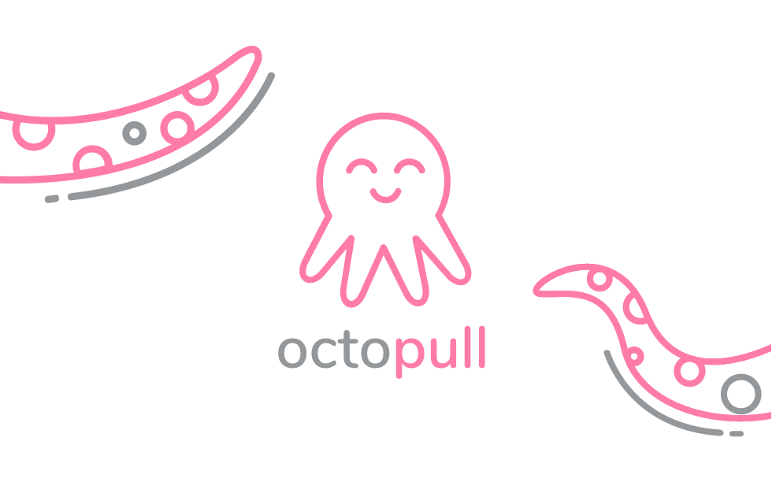

# octopull

**octopull** /ˈɒktəpəs/ *noun*
~~a cephalopod mollusc with eight sucker-bearing arms, a soft sac-like body, strong beak-like jaws, and no internal shell.~~ Your multi repo pull request buddy :) **octopull** your git repos!


README driven development :P

```js
const octopull = require('octopull')

octopull.commit({
  files: ['file1.txt', 'file2.yml'],
  branch: 'update-foo', // autogenerated if blank
  message: 'a cool commit msg', // autogenerated if blank
  // OPTIONAL
  pullRequest: {
    title: 'a cool PR title', // autogenerated if blank
    body: 'a cool PR body', // autogenerated if blank
    // OPTIONAL
    // assignees: ['username1', 'username2']
    // reviewers: ['username3', 'username4']
  }
})
```

## Develop

### Setup

```sh
git clone https://github.com/alvaropinot/octopull

cd octopull
npm install
```

### Run

```sh
# You will need to use `--harmony-async-await` flag to run async/await code.
node --harmony-async-await lib/index.js
```

## License

MIT - [@alvaropinot](http://twitter.com/alvaropinot) Alvaro Pinot

* CC Logo Octopus by Mark Aventura from the Noun Project
* CC Logo Octopus Tentacles by Iconic from the Noun Project
